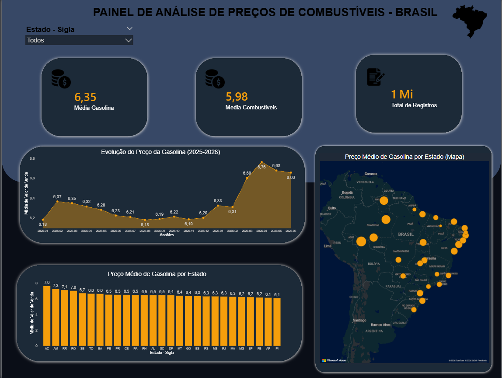
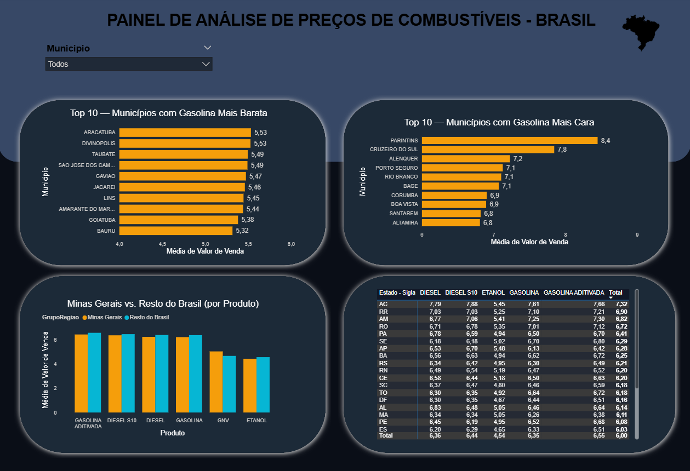

Markdown
# ⛽ Panorama de Preços de Combustíveis no Brasil (2025-2026)

Pipeline completo de dados — **Python, SQL e Power BI** — analisando a **Série Histórica de Preços de Combustíveis da ANP**, cobrindo mais de **1,2 milhão de registros** de postos revendedores em todo o Brasil.

---

## 📌 Contexto

Projeto de portfólio desenvolvido para praticar um pipeline de dados ponta a ponta: extração de dados públicos, tratamento em Python, análise em SQL (incluindo *window functions*) e visualização em Power BI.

* **Fonte dos dados:** [Série Histórica de Preços de Combustíveis - ANP](https://www.gov.br/anp/pt-br/centrais-de-conteudo/dados-abertos/serie-historica-de-precos-de-combustiveis)

---

## 🔄 Pipeline

Dados brutos (ANP, 3 semestres) ➔ Python (tratamento) ➔ SQL (análise) ➔ Power BI (dashboard)

### 1. Python (Pandas)
- Concatenação de 3 arquivos semestrais (`2025-01`, `2025-02`, `2026-01`).
- Correção de encoding (`BOM`/`UTF-8`) e separador de campo.
- Conversão de tipos: preço (texto BR $\rightarrow$ decimal), data (texto $\rightarrow$ data).
- Tratamento de **9.114 valores nulos** e **6 duplicados**.
- Padronização de inconsistência na coluna de unidade de medida.

### 2. SQL (SQLite)
- Carga do dado tratado em banco relacional.
- 5 análises, incluindo uso de **window function (`LAG`)** para calcular variação percentual mês a mês.

### 3. Power BI
- Medidas DAX (preço médio, filtros por produto/região).
- Dashboard com KPIs, evolução temporal, mapa geográfico, rankings e comparação regional.

---

## 📊 Volume de dados

| Métrica | Valor |
|---|---|
| **Linhas tratadas** | 1.227.029 |
| **Período** | jan/2025 a jun/2026 (3 semestres) |
| **Cobertura** | 27 estados (todo o Brasil) |
| **Produtos** | Gasolina, Gasolina Aditivada, Diesel, Diesel S10, Etanol, GNV |
| **Bandeiras** | 49 (Raízen, Ipiranga, Vibra, e distribuidoras regionais) |

---

## 💡 Principais achados

- **Acre tem a gasolina mais cara do Brasil** (R$ 7,61/litro em média); **Piauí, a mais barata** (R$ 6,08) — uma diferença de quase 26%.
- Os maiores saltos mensais de preço da série ocorreram em **março/2026 (+4,61%)** e **abril/2026 (+2,41%)**, coincidindo com o reajuste do ICMS sobre combustíveis (jan/2026) e a escalada do conflito entre Estados Unidos e Irã, que pressionou o preço internacional do petróleo.
- **Minas Gerais** fica consistentemente abaixo da média nacional em todos os combustíveis líquidos, com exceção do GNV, onde é ~8% mais caro que o resto do país.
- **Parintins (AM)** é o município com a gasolina mais cara do país (R$ 8,45); **Goiatuba (GO)**, o mais barato (R$ 5,81).

---

## 🖥️ Dashboard / Visualização

### Visão Geral e Evolução Temporal


### Rankings de Municípios e Comparativo Regional


---

## 📁 Estrutura do repositório

<pre> ``` precos-combustiveis-anp/ - Assets/ - dashboard.png - dashboard2.png - dados/ - brutos/ (nao versionado) - tratados/ (nao versionado) - notebooks/ - 01_exploracao.ipynb - 02_tratamento.ipynb - 03_carga_sql.ipynb - 04_analises.ipynb - sql/ - preco_medio_UF.sql - variacao_mensal.sql - variacao_percentual_mes.sql - ranking_caras.sql - ranking_baratas.sql - minas_vs_media_geral.sql - powerbi/ - dashboard_precos_combustiveis.pbix - .gitignore - README.md ``` </pre>

> **⚠️ Nota sobre a pasta de dados:** Devido às limitações de tamanho de arquivos do GitHub e seguindo as boas práticas de versionamento de código, os arquivos das pastas `dados/brutos/` e `dados/tratados/` foram omitidos do repositório via `.gitignore`. 

---

## 🚀 Como reproduzir o projeto

1. **Obtenção dos dados:**
   - Faça o download dos dados brutos diretamente na [Série Histórica da ANP](https://www.gov.br/anp/pt-br/centrais-de-conteudo/dados-abertos/serie-historica-de-precos-de-combustiveis).
   - Salve os arquivos CSV baixados no diretório `dados/brutos/`.

2. **Execução do pipeline:**
   - Abra a pasta `notebooks/` e execute os arquivos Jupyter na ordem numérica proposta (`01`, `02`, `03` e `04`).
   - Os arquivos tratados e o banco SQLite serão gerados automaticamente na pasta `dados/tratados/`.

3. **Visualização:**
   - Abra o arquivo em `powerbi/` utilizando o Power BI Desktop para navegar pelo dashboard interativo.

---

## 🛠️ Ferramentas utilizadas

`Python` `Pandas` `SQL` `SQLite` `Power BI` `DAX`

---

## 👤 Autor

**Caio Vitor Fonseca Diniz**  
🔗 [LinkedIn](https://www.linkedin.com/in/caio-vitor-fonseca-diniz-037485257/)
